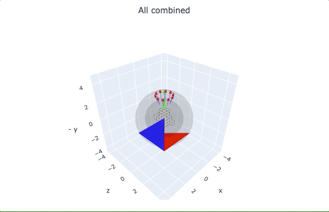
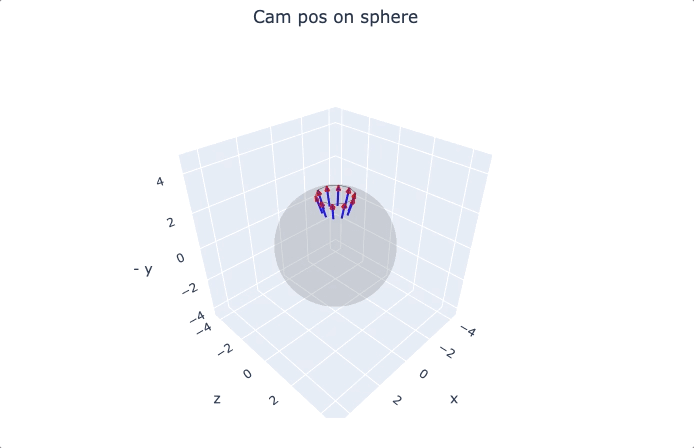
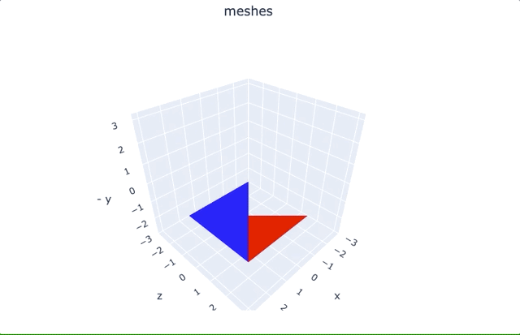
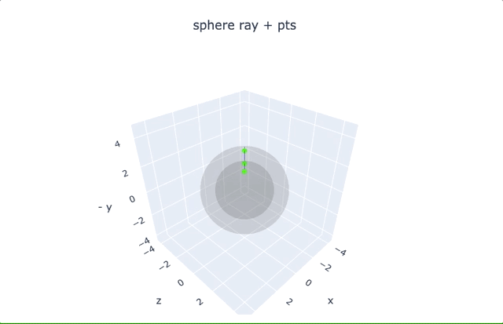
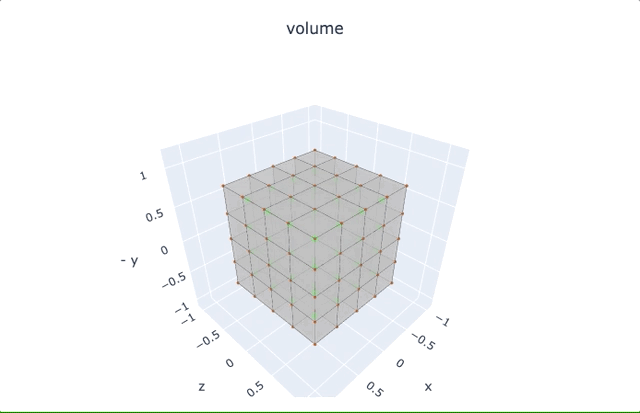
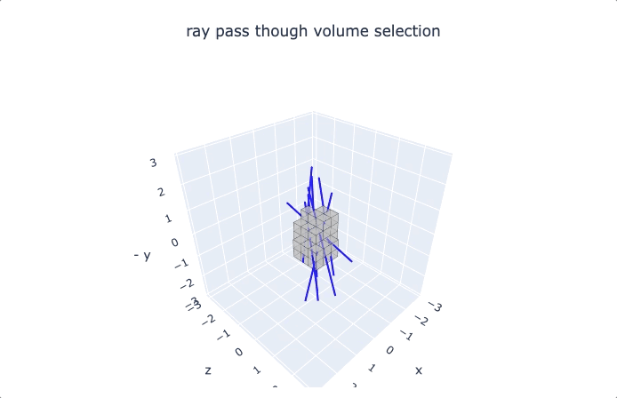

# ArcVis

This is a visualization library for 3d/2d plot. It is helpful for developing geometric algorithms and check their correctness.

We use numpy array for 3d/2d data structure, and many of the geometric function are in torch.

We provide some basic geometric implementation and visual samples. For more example usage, please visit our repo
[ArcNerf](https://github.com/TencentARC/ArcNerf). There will be more useful examples using this vis lib.

------------------------------------------------------------------------

# plot3d
We provide a `draw_3d_components` that is helpful to plot camera/points/rays/lines/sphere/meshes/volume
with customized color in all. 

For all point, it should be in world space, or transformed to world space.
Then change to plt space. The visual space is (x-right, y-down, z-forward).
But we show the y values as -y inorder to make y goes downward.

------------------------------------------------------------------------
## Backend
We provide `matplotlib` and `plotly` for visualization. By default it use `plt`.

`Plotly` is good for interactive visualization
and is able to zoom-in/out, move. We can add `plotly=True` in `draw_3d_components`.

------------------------------------------------------------------------
## Camera
- c2w pose: in `(N_cam, 4, 4)`. Local camera models will be created and transformed into world space
- cam_colors: in `(N_cam, 3)` or `(3,)` can be used to color each or all cams
- intrinsic: in `(3, 3)` is used to adjust local cam model for actual ray direction.

------------------------------------------------------------------------
## Points
- point: in `(N_p, 3)` in world space
- point_size: is single value used to set each point size
- point_color: in `(N_p, 3)` or `(3,)` can be used to color each or all points

------------------------------------------------------------------------
## Lines
- lines: a list of lines in `(N_pts_in_line, 3)` in world space, total `N_line`,
each line prints `N_pt_in_line-1` line seg
- line_width: is single value or list of value used to set each line width.
- line_colors: in `(N_line, 3)` or `(3,)` can be used to color each or all lines

------------------------------------------------------------------------
## Meshes
- meshes: a list of mesh of `(N_tri, 3, 3)` in world space, len is `N_m`
- mesh_colors: color in `(N_m, 3)` or (3,), applied for each or all mesh
- face_colors: color in `(N_tri, 3)`, len is `N_m`, for each mesh if set.

------------------------------------------------------------------------
## Rays
- rays: a tuple `(rays_o, rays_d)`, each in `(N_r, 3)`, in world coord. `rays_d` is with actual len, if you want longer arrow, you need to extend `rays_d`
- ray_colors: color in `(N_r, 3)` or `(3,)`, applied for each or all rays
- ray_linewidth: width of ray line, by default is 1

## Sphere
- sphere_radius: draw a sphere with such `radius` if not None
- sphere_origin: the origin of sphere, by default is `(0, 0, 0)`

------------------------------------------------------------------------
## Volume
A complete volume implementation is in `geometry.volume`. You only input points/lines/faces for visual results.
- 'grid_pts': grid point, ((n+1)^3, 3). If use corner only, (8,3)
  - grid_pts_colors: pts_colors in str. If not exist, use `chocolate`.
  - 'grid_pts_size': pts_size. If not exist, set 20.
- 'volume_pts': volume point, (n^3, 3)
  - 'volume_pts_colors: pts_colors in str. If not exist, use `green`.
  - 'volume_pts_size': pts_size. If not exist, set 20.
- 'lines': lines of bounding lines or dense lines. list of lines in (2, 3)
- 'faces': faces of bounding faces or dense faces, np in ((n+1)n^2, 4, 3).
regroup each face to 2 triangles for visual
  - face_colors: face_colors in str. If not exist, use `silver`.

------------------------------------------------------------------------
## Other:
- title: title of the fig
- save_path: if `None`, will show the fig, otherwise save it
- axis range: update by the component with max values (xyz), show in a cube with same lengths.
- return_fig: If set to True and save_path is None, will return the fig(plt) or numpy array(plotly) for further usage.
- show_axis: If False, do not show axis but only the fig. By default True.

------------------------------------------------------------------------
# plot2d
In `plot_2d.py`, we provide a `draw_2d_components` that is
helpful to plot points/lines in defined colors with legends. We use `matplotlib` as backend.

------------------------------------------------------------------------
# Notebook:
- We provide the python notebook in `draw_3d_examples.ipynb` to use the 3d render 
and `draw_2d_examples.ipynb` to use the 2d drawer.
